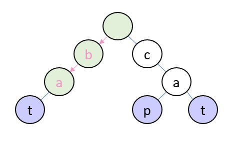
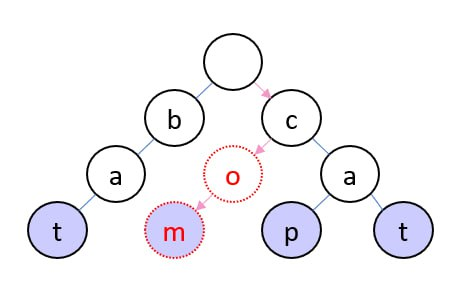

# Trie

Trie (字典樹) 是一種無序的樹狀資料結構，用來儲存字串的集合，支援查詢一個字串是否存在於集合中。

最基本 Trie 支援以下兩三種操作：

1. 查詢一個字串是否存在於集合中
2. 加入一個字串進入集合
3. 從集合中刪除一個字串

使用 Trie 可以在線性時間（字串長度）完成這三種操作。

## Basic Trie

Trie 是一個樹狀結構，每一個節點代表的是一個 prefix，其中根節點代表的前綴是空字串。
而每個邊代表的是一個字元，一個代表前綴 `pre` 的節點，會透過代表 `c` 字元的邊，連向代表前綴 `pre + c` 的節點。

有了這個樹狀的 Trie，我們可以在節點上儲存一些資訊，在查詢是否存在的這個例子，我們可以在每個節點上
存一個 `int` 代表目前的字串集合，有幾個字串等於這個節點代表的字串。


這個樹是加入了 `bat`, `cat`, `cap` 三個字串得到的 Trie。

### 查詢

查詢一個字串是否出現在集合中，我們可以從跟節點（空字串）開始，照著要查詢的字串，
由左至右，對於每個字元，在當前的節點走向代表那個字元的節點。如果節點沒有連向那個字元的邊
，這代表字典樹沒有這個前綴。如果順利的走完所有的字元，停在一個節點上。我們便可以
根據節點上儲存的數字，判斷集合中是有存在這個字元，或是這個字元只是某個元素的前綴。




### 加入 / 刪除

若要加入與刪除字元，需要先依照查詢的方法，找到代表目標字串的節點，就可以修改節點上的數字。
加入不同於查詢的地方在於，如果在其中一個步驟找不到邊時，應該要創造節點並且將邊連上。



上圖為 Trie 中加入 `com` 的例子。

## 複雜度分析

查詢、加入、刪除一個長度為 L 的字串都需要 \\(O(L)\\) 的時間複雜度，以及 \\(O(L)\\) 的空間複雜度。讀者可能會拿 trie 跟 hash set 比較，的確如果考慮將字串 hash 之後以 hash set 儲存，可以達到與 trie 相同的複雜度，但時務上，trie 可以提供的確定性，以及維護共同前綴的特性，時常能夠幫助解決更多的問題。下一章節 XOR Trie 就會是很好的使用 trie 的例子。

## 實作

```cpp
#include <bits/stdc++.h>

template<typename T, std::size_t _Nm> 
class TrieNode {
private:
  template<typename IT>
  TrieNode* get(IT begin, IT end, bool create=false) {
    if (begin == end) {
      return this;
    }

    auto &next_node = _next_ptr[*begin];
    if (next_node == nullptr && create) {
      next_node = std::make_unique<TrieNode>();
    }

    return next_node == nullptr ? nullptr : next_node->get(std::next(begin), end, create);
  }
public:
  std::array<std::unique_ptr<TrieNode>, _Nm> _next_ptr;
  T _data;

  TrieNode() : _next_ptr(), _data() {}

  template<typename C>
  TrieNode* get(const C &c, bool create=false) {
    return get(std::begin(c), std::end(c), create);
  }
};
```

## XOR Trie

XOR Trie 是一種 Trie 的應用，通常使用時機是求在一個整數集合中，XOR 值最大或最小的兩個元素。讓我們用一個實際的例題來認識 XOR Trie:

### 例題: BZOJ1954 樹上最大 xor sum 路徑

一棵帶有正整數邊權的無根樹，求 \\((u, v)\\) 使得節點 \\(u\\) 到 \\(v\\) 的路徑之間邊權 xor 總和最大，輸出這個邊權 xor 總和。 (\\(1 \leq N \leq 10^5, 0 \leq w \le 2^31\\))

這題需要一點點的拆開題目包裝，我們定義 \\(T(u, v)\\) 為在樹上 \\(u\\) 到 \\(v\\) 之間的路徑 xor sum。我們可以發現指定任意一個節點作為 root 我們有 \\(T(u, v) = T(u, root)\\) xor \\(T(v, root)\\)。有這樣的觀察，我們可以用一次 dfs 對於所有節點 x 計算出 \\(T(x, root)\\)。接著問題就轉換成：如何在一個整數集合中，找出 XOR 值最大的兩個元素。

解決這個最大 xor pair 問題，我們可以使用 XOR Trie。我們把每個數字以 31 bits 二進位表示，並且保留 leading zeros。我們把這些數字當作字元集只有 0 與 1 長度皆為 31 的字串插入一棵字典樹。這個字典樹代表著我們的整數集合，我們可以在 \\(O(\log w)\\) 的時間內查詢一個數字是否在集合中。

然而使用一般的查詢是無法解決這個最大值問題，我們需要使用類似線段樹上二分搜的技巧處理。要最大化 \\(T(u, v)\\)，首先我們可以枚舉 \\(u\\)，對於每個 \\(T(u, root)\\) 我們要找到一個 v 使得 \\(T(u, root)\\) xor \\(T(v, root)\\) 最大。對筆者來說，這個技巧與其說是二分搜，我更喜歡用 greedy 的想法去理解。我們要在 trie 中代表的集合，找出一個元素 \\(T(v, root)\\) 最大化 \\(T(u, root)\\) xor \\(T(v, root)\\)。我們可以從 root 開始，從最高位開始 greedy，優先選擇與 \\(T(u, root)\\) 最高位相反的 edge，如果相反的 edge 是存在的，選擇它一定更優。如果相反的 edge 不存在，只能選擇往相同的 edge 走去。接著對於第 2~31 bit 也使用同樣的策略，看與 \\(T(u, root)\\) 該 bit 相反的 edge 是否存在，盡量走相反的 edge。最後走完 \\(31\\) 條邊，得出來的 node 代表的就會是我們想要最大化 \\(T(u, root)\\) xor \\(T(v, root)\\) 的 \\(v\\)。

### 參考程式碼

```cpp
#include <bits/stdc++.h>

template<typename T, std::size_t _Nm> 
class TrieNode {
private:
  template<typename IT>
  TrieNode* get(IT begin, IT end, bool create=false) {
    if (begin == end) {
      return this;
    }

    auto &next_node = _next_ptr[*begin - '0'];
    if (next_node == nullptr && create) {
      next_node = std::make_unique<TrieNode>();
    }

    return next_node == nullptr ? nullptr : next_node->get(std::next(begin), end, create);
  }
public:
  std::array<std::unique_ptr<TrieNode>, _Nm> _next_ptr;
  T _data;

  TrieNode() : _next_ptr(), _data() {}

  template<typename C>
  TrieNode* get(const C &c, bool create=false) {
    return get(std::begin(c), std::end(c), create);
  }
};

using Edges = std::vector<std::vector<std::pair<int, int>>>;

void DFSXorPathSum(int node, const Edges &edges, std::vector<int> &xor_sum) {
  for (auto [child, weight]: edges[node]) {
    if (xor_sum[child] == -1) {
      xor_sum[child] = xor_sum[node] ^ weight;
      DFSXorPathSum(child, edges, xor_sum);
    }
  }
}

int main() {
  std::ios_base::sync_with_stdio(0);
  std::cin.tie(0);
  int n;
  std::cin >> n;
  Edges edges(n);
  for (int i = 0; i < n - 1; ++i) {
    int u, v, w;
    std::cin >> u >> v >> w;
    u--, v--;
    edges[u].emplace_back(v, w);
    edges[v].emplace_back(u, w);
  }

  std::vector<int> xor_sum(n, -1);
  xor_sum[0] = 0;
  DFSXorPathSum(0, edges, xor_sum);

  TrieNode<int, 2> root;
  for (int i = 0; i < n; ++i) {
    const std::string value = std::bitset<31>(xor_sum[i]).to_string();
    root.get(value, true);
  }

  int t_u_v_max = 0;
  for (int i = 0; i < n; ++i) {
    const std::string t_u_root = std::bitset<31>(xor_sum[i]).to_string();
    auto *itr = &root;
    int t_v_root = 0;
    for (int b = 30; b >= 0; --b) {
      int flip = '1' - t_u_root[30 - b];
      int edge = itr->_next_ptr[flip] ? flip : (1 - flip);
      t_v_root += edge << b;
      itr = itr->_next_ptr[edge].get();
    }
    t_u_v_max = std::max(t_u_v_max, t_v_root ^ xor_sum[i]);
  }

  std::cout << t_u_v_max << std::endl;
}
```

## Persistence XOR Trie

Trie 是一種樹狀結構，因此可以很容易的持久化，維護每次操作的版本。實作方法可以參考持久化線段樹，每次操作把路徑上的所有節點，複製出一份，所有的值得修改與指標的修改，都只在新的備份上，不會動到舊版本節點。最後儲存每一次操作所得出的新的根，則可以代表該次操作版本的 Trie。

### 例題: Range Maximum XOR Query

題目：

給定一個正整數陣列 \\(A\\)，每次詢問給 \\(l, r, x\\) 求 \\( max_{a\in A[l, r]} x \oplus a\\)

題解：

假如這題詢問不是子陣列，而是整個陣列，那我們可以用 XOR Trie 的技巧解決。與上面例題相似，我們可以使用 greedy algorithm (binary search on tree) 的技巧，從根開始，盡量選擇與 \\(x\\) 想法的位元。

但這個問題變成區間詢問，因此我們可以使用 persistence xor trie 解決。這題的 trie 我們每個節點要維護每個節點，其子樹代表的集合有幾個元素。接著，我們把陣列 A 的元素從左至右依序加入 persistence trie，第 \\(0\\) 號版本是一個 root 代表一個空集合的 trie，接著加入第 \\(i\\) 個元素時，所產生的根節點，儲存為版本 \\(i\\) 的根節點。

有的這樣的 persistence xor trie 我們可以透過比較第 \\(r\\) 個版本，與第 \\(l - 1\\) 個版本，我們可以從第 \\(i\\) 個版本知道陣列 \\(A[1]...A[i]\\) 中，前綴為 \\(s\\) 的字串有幾個（查詢子樹元素總和）。因此我們可以透過相減 \\(r\\) 版本與 \\(l-1\\) 版本的子樹元素總和，求出陣列\\(A[l]...A[r]\\) 中，有多少前綴為 \\(s\\) 的元素。

我們成功把區間問題，透過版本的比較，轉換成原本的陣列問題。相減兩個 trie 得到的虛擬 trie，可以作為一個代表子陣列的 trie 使用。我們可以透過 greedy algorithm (binary search on tree) 的技巧，解決這個問題。（詳細作法見上個章節題解）

### 複雜度分析

考慮到每次新增會增加一個長度為 \\(L\\) 所會創造出的節點數還是 \\(O(L)\\)，時間複雜度和空間複雜度與一般的 trie 一樣皆是線性於操作的字串長度。

### 參考程式碼

```cpp
#include <bits/stdc++.h>

const int kMaxBits = 30;
class TrieNode {
 public:
  std::shared_ptr<TrieNode> Add(int value, int index) {
    auto new_node = std::make_shared<TrieNode>(*this);
    if (index == -1) {
      ++new_node->size_;
    } else {
      int bit = (value >> index) & 1;
      if (!new_node->next_[bit]) {
        new_node->next_[bit] = std::make_shared<TrieNode>();
      }
      new_node->next_[bit] = new_node->next_[bit]->Add(value, index - 1);
      new_node->Pull();
    }
    return new_node;
  }

  void Pull() {
    size_ = 0;
    for (int i : {0, 1}) {
      if (next_[i]) {
        size_ += next_[i]->size_;
      }
    }
  }

  std::array<std::shared_ptr<TrieNode>, 2> next_;
  int size_;

  TrieNode() : next_(), size_() {}
  TrieNode(const TrieNode&) = default;
};

int main() {
  int n, q;
  std::cin >> n >> q;

  std::vector<std::shared_ptr<TrieNode>> node_version;
  node_version.push_back(std::make_shared<TrieNode>());

  for (int i = 1; i <= n; ++i) {
    int value;
    std::cin >> value;
    auto new_node = node_version.back()->Add(value, kMaxBits);
    node_version.push_back(new_node);
  }

  for (int _ = 0; _ < q; ++_) {
    int l, r, a;
    std::cin >> l >> r >> a;

    auto l_node = node_version[l - 1];
    auto r_node = node_version[r];

    auto Next = [](auto node, int b) {
      return node ? node->next_[b] : nullptr;
    };

    auto GetSize = [](auto node, int b) {
      if (node && node->next_[b]) {
        return node->next_[b]->size_;
      } else {
        return 0;
      }
    };

    int best_b = 0;
    for (int j = kMaxBits; j >= 0; --j) {
      int bit = (a >> j) & 1;
      int size = GetSize(r_node, !bit) - GetSize(l_node, !bit);
      if (size > 0) {
        r_node = Next(r_node, !bit);
        l_node = Next(l_node, !bit);
        best_b += (!bit) << j;
      } else {
        r_node = Next(r_node, bit);
        l_node = Next(l_node, bit);
        best_b += (bit) << j;
      }
    }
    std::cout << (a ^ best_b) << std::endl;
  }
}
```

## 其他例題

### 最大 XOR sum 子陣列

題目：

給定一個正整數陣列 \\(A\\)，求 xor sum 最大的子陣列。

題解：

這題可以透過前綴和的技巧。定義 \\(X(L, R) = A[L] \oplus A[L+1] \oplus ... \oplus A[R] \\)，我們對於所有 \\(1 \leq i \leq N\\) 計算 \\(P(i) = X(1, i)\\)。因為 \\(\forall x \geq 0, x \oplus x = 0\\)，我們可以推得 \\(X(L, R) = X(1, L - 1) \oplus X(1, R)\\)。因此最大化 \\(X(L, R)\\) 其實就相當於找到兩個元素 \\(L, R\\) 最大化 \\(P(L - 1) \oplus P(R)\\)

因此我們同樣可以使用 xor trie 的技巧，先將所有 \\(P(i)\\)加入 xor trie，接著我們枚舉第一個元素 L，我們即可以在 trie 中尋找最大化 \\(P(L) \oplus P(R)\\) 的 R。

## 結語

本文章從最基本的操作開始，介紹了 trie 的用途與實作。接著將 Trie 延伸到 xor sum 的應用上，維護一個集合的精神不變，只是從正常的字串延伸到二進位的 01 字串。因為表示的是數字，因此可以使用 greedy 的方式找集合中的最大值。文章最後介紹了 persistence trie，示範了如何實作持久化的 trie，並且介紹如何使用持久化資料結構，將一些區間問題，轉換成陣列問題。

## 參考資料


- https://oi-wiki.org/string/trie/#%E7%BB%B4%E6%8A%A4%E5%BC%82%E6%88%96%E6%9E%81%E5%80%BC
- https://www.topcoder.com/thrive/articles/Using%20Tries
- https://iq.opengenus.org/persistent-trie/
- https://codeforces.com/blog/entry/93724
